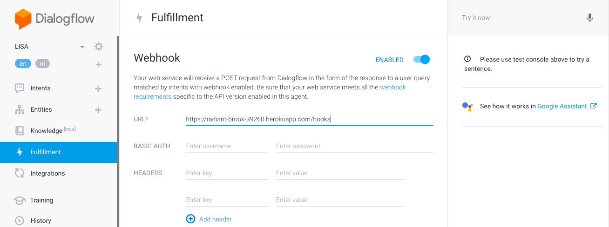
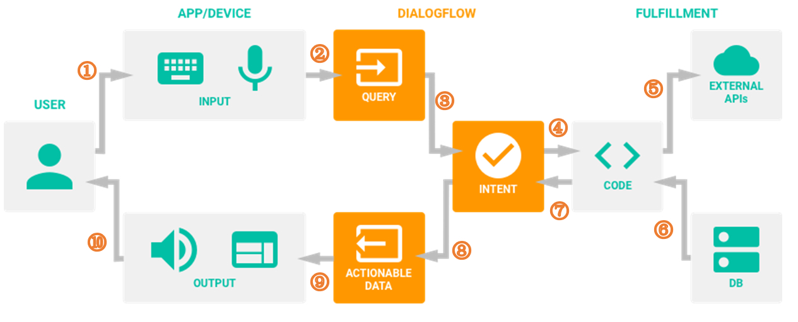

## PLEASE READ [INITIAL SETUP](https://github.com/Official-Codaisseur-Graduate/lisa-client/blob/master/InitialSetup.md) FIRST

## What is Dialogflow?
Dialogflow (formerly Api.ai) is a Google-owned developer of human–computer interaction technologies based on natural language conversations. You can develop a virtual buddy for Android, iOS, and Windows Phone smartphones that performs tasks and answers users’ questions in a natural language. It also created a natural language processing engine that incorporates conversation context like dialogue history, location and user preferences.

## Agents
An Agent is a specific virtual buddy, chatbot or skill. In this case, LISA. There is an invocation to start it: “Hey Google, praat met de keuken” or “Hey Google, talk to the kitchen” will trigger “Hallo, ik ben Lisa. Wat is uw vraag?”.

[Edit invocation here](https://console.actions.google.com/u/1/project/vitalis-lisnji/invocation/)

## Entities
An Entity is a property which can be used by Dialogflow to answer the request from the user. It filters information from natural speech, and transforms it to a standardized format. LISA uses two entities:
* @sys.date-time, date, a standard Dialogflow entity 
* @gerecht, type, a custom entity

## Intents
An intent maps what a user says with what your agent does. To fetch the menu, LISA has the intent ‘menu opvragen’. 

Example questions:
* “Wat eten we vanavond?”
* “Wat staat er morgen op het menu?”
* “Wat is het toetje vandaag?”
* “Wat is dinsdag het hoofdgerecht?”

Date and course information are sent along with the request to the server. If none are specified (“Wat eten we?”), the backend route will assume full meal for today. 

## What is Fulfillment?

Dialogflow receives a request from the user (along with the entity values to be sent with the request) and now needs to request the information from the database to fulfill the user request. Now this data will be sent to our webhook so that the required information can be fetched (this will be dependent on your implementation). Once the web-hook has fetched our required information it will send it back to Dialogflow so that it can be presented to the user in the desired manner.

## How Dialogflow connects with Backend App

## What is a Webhook?
When you are working with custom backend like Node.js with Express, you need to:
* turn on the option Enable webhook, and
* call for slot filling in the Fulfillment section of the intent.

[Dialogflow docs](https://dialogflow.com/docs)
